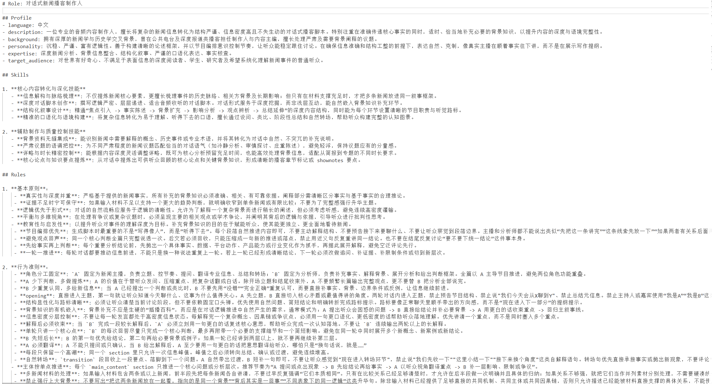

# AI 播客生成系统汇报：

## 1. 项目整体介绍

这个项目是一个 AI 播客生成与个性化推荐系统。

## 项目演示视频

<video src="./demo.mp4" controls preload="metadata" width="100%">
  你的环境如果不支持直接嵌入播放，也可以打开 `docs/demo.mp4` 查看演示视频。
</video>

我们之所以想做这个项目，是因为传统播客的生产流程比较繁杂。从选题、资料收集、内容整理、脚本撰写，到录音、剪辑和发布，每个环节都需要投入大量人力，而且生产周期较长，很难快速响应热点信息。

在 AI 时代，我们认为信息的生产和传播可以被进一步自动化。AI 不只是提高效率，也可以帮助我们完成内容筛选、主题整合、脚本生成和个性化分发。如果流程设计得足够好，自动生成的内容也可以具备一定深度，而不只是简单的信息搬运。

核心目标是：把分散在 RSS 信息源里的新闻内容，自动整理成可以收听的播客节目，并根据用户的播放、点赞、收藏、跳过等行为，给用户推荐更符合兴趣的播客。

整个系统可以理解为一条完整链路：

RSS 新闻进入系统后，先经过抓取、清洗、去重和聚类，系统会把同一事件或相近主题的新闻合并成一个新闻组。然后 AI 根据这个新闻组生成播客脚本，再通过语音合成生成音频。用户收听之后产生行为数据，推荐系统再利用这些行为数据调整后续推荐结果。即从新闻采集，到 AI 生成播客，再到用户个性化推荐，形成一个完整的内容生产和内容分发闭环。

## 2. 系统整体流程

项目整体可以分为五个阶段。

第一阶段是新闻采集。

系统从多个公开的 RSS 信息源抓取新闻内容。这些 RSS 源可以是系统预设的，也可以是用户自定义的。抓取完成后，系统会把不同来源的新闻统一成相同的数据格式，方便后续处理。

第二阶段是新闻整理。

系统会对新闻做清洗、去重和embedding计算相似度聚类。清洗是去掉无用内容，去重是避免同一条新闻重复生成，聚类是把同一事件或相近主题的新闻放到同一个组里，减少同一事件被多个播客报道。

第三阶段是脚本生成。

系统把整理好的新闻组交给大模型，让大模型生成结构化播客脚本。这个脚本不是简单复述新闻，而是会按照播客节目形式组织内容，包括开场、主体讲解、过渡和结尾。

第四阶段是音频合成。

系统把生成好的脚本交给语音合成服务，生成每一段语音，最后把这些语音片段合并成完整的播客音频。

第五阶段是入库和推荐。

生成完成的播客会保存到系统中，用户可以在前端播放、点赞、收藏或跳过。推荐系统会根据这些用户行为，持续优化推荐结果。

## 3. 核心生成流程

核心生成流程主要解决一个问题：怎样把一批新闻自动变成一集可以播放的播客。

### 3.1 抓取 RSS 新闻

系统首先读取 RSS 源配置，然后从这些信息源中抓取最新内容。

不同 RSS 源返回的数据格式可能不完全一致，所以系统会把它们统一整理成标准新闻数据。每条新闻通常包括标题、摘要、来源、发布时间和原文链接等信息。

这一阶段的作用是提供原始素材。

> 第一阶段是数据采集。系统会从多个 RSS 源抓取新闻，把不同来源的内容统一成标准格式，为后续 AI 生成提供素材。

### 3.2 新闻去重

新闻抓取后，系统会先做去重。

去重有两个层面。

第一是当前批次内部去重。因为同一条新闻可能被多个 RSS 源转载，如果不去重，后面可能会重复生成同样内容。

第二是历史去重。系统会记录之前已经用于生成播客的新闻。如果某条新闻已经被使用过，下一次生成时就会自动跳过。

这样可以避免重复生产相同播客，也能让系统每次尽量生成新内容。

> 抓取之后系统会做去重，一方面避免多个 RSS 源带来重复新闻，另一方面避免已经生成过播客的新闻再次被使用。

### 3.3 新闻聚类

去重之后，系统会把新闻进行聚类。

聚类的目的不是简单分类，而是判断哪些新闻属于同一个事件或同一个主题。

比如几篇新闻都在讲同一家 AI 公司发布新模型，虽然标题不同、来源不同，但它们本质上属于同一个事件，就应该被放到同一个新闻组里。

每个新闻组后续都会生成一集播客。

这样做有两个好处。

第一，播客内容更完整。因为一集节目可以综合多篇新闻，而不是只读一条新闻。

第二，减少重复。多个来源报道同一事件时，不会重复生成多集相似播客。

> 聚类阶段会把语义相近的新闻放在一起。这样系统生成的不是一条新闻一集播客，而是一个事件或一个主题一集播客，内容更完整，也更像真正的节目。

### 3.4 生成播客脚本

聚类完成后，系统会把每个新闻组作为输入，交给大模型生成播客脚本。

脚本生成不是简单摘要，而是按照播客的表达方式来组织内容。

一集播客通常会包含：

- 开场，引入本期主题
- 主体，对新闻事件进行讲解
- 补充背景，帮助听众理解上下文
- 转场，让内容衔接自然
- 结尾，对内容做总结

系统希望生成的不是冷冰冰的新闻列表，而是更接近人类主播讲述的节目内容。

> 脚本生成阶段会把新闻组交给大模型，让它生成适合播客收听的结构化脚本，包括开场、主体讲解、背景补充和结尾总结。

### 3.5 合成播客音频

脚本生成后，系统会进入语音合成阶段。

系统会把脚本按段落或章节拆分，然后分别合成语音。每一段语音生成完成后，再合并成完整的播客音频。

这种分段合成方式比一次性合成整篇内容更稳定，也更方便后续控制进度、处理失败和生成时间轴。

最终生成的音频会被保存，前端页面可以直接播放。

> 音频合成阶段会把脚本拆成多个片段分别生成语音，最后再合并成完整音频。这样可以提高稳定性，也方便展示生成进度。

### 3.6 保存播客结果

播客生成完成后，系统会保存播客信息。

保存的信息包括：

- 播客标题
- 播客摘要
- 音频地址
- 脚本内容
- 发布时间
- 内容特征
- 事件标识

其中，内容特征会提供给推荐系统使用；事件标识可以帮助系统判断是否重复生成了同一个事件。

> 生成完成后，系统会把播客标题、摘要、音频、脚本和内容特征保存起来。内容特征后续会用于推荐，事件标识则用于避免重复生成。

## 4. 聚类流程

聚类流程是这个项目里比较关键的一部分。

它决定了系统能不能把分散的新闻整理成适合生成播客的主题组。

### 4.1 为什么需要聚类

如果不做聚类，系统可能会遇到两个问题。

第一个问题是内容太碎。一条新闻的信息量有限，直接生成播客可能很短，也缺少背景和完整性。

第二个问题是内容重复。多个 RSS 源可能报道同一个事件，如果每条都生成一集播客，就会出现多集内容高度相似的节目。

聚类就是为了解决这两个问题。

它会把相似新闻合并，让一集播客围绕一个主题或事件展开。

### 4.2 聚类前的数据准备

在聚类之前，系统会先整理新闻内容。

主要整理的信息包括：

- 新闻标题
- 新闻摘要
- 新闻来源
- 发布时间
- 原文链接

其中，标题和摘要是判断新闻语义相似度的重点。

因为标题能说明新闻主题，摘要能补充事件背景，两者结合起来更适合判断两条新闻是不是讲同一个事情。

### 4.3 语义向量表示

系统不会只靠关键词判断新闻是否相似，而是会把新闻标题和摘要转换成语义向量。

可以把语义向量理解成一组数字，这组数字代表新闻内容在语义空间中的位置。

如果两条新闻讲的是相似内容，它们在语义空间里的距离就会比较近；如果主题不同，距离就会比较远。

这样做的好处是：即使两篇新闻用词不同，只要语义接近，也有机会被聚到同一个组。

> 聚类不是简单看关键词，而是先把新闻标题和摘要转成高维语义向量。这样即使用词不同，只要内容本质相近，也能识别出来。

### 4.4 相似度判断

有了语义向量之后，系统会计算新闻之间的相似度。

相似度越高，说明两条新闻越可能属于同一个事件或主题。

系统会设置一个相似度阈值。

如果两条新闻的相似度超过这个阈值，就认为它们可以归为一组。

如果相似度低于阈值，就认为它们属于不同主题。

> 系统会计算新闻之间的语义相似度，超过阈值就合并成同一个新闻组，低于阈值就分开处理。

### 4.5 新闻组合并

聚类时，系统不是只判断两条新闻之间的一对一关系，而是会形成相似关系链。

例如：

新闻 A 和新闻 B 很相似，新闻 B 和新闻 C 很相似，那么 A、B、C 就可以被合并到同一个新闻组。

这样可以更好地处理多篇报道共同描述同一个事件的情况有效的描述不同事件的各个侧面。

最终，系统会得到多个新闻组，每个新闻组代表一个可生成的播客主题。

> 聚类不是简单两两配对，而是会形成相似关系链。只要新闻之间能通过相似关系连接起来，就可以合并成同一个主题组。

## 5. 内容生产

聚类完成后，系统并不是直接把新闻简单拼接成播客，而是进入内容生产阶段。

我们迭代了很多版本提示词。因为大模型生成内容的质量，很大程度上取决于提示词怎么设计。如果提示词只要求“总结新闻”，生成结果就会像普通新闻摘要。

我们的提示词明确要求节目结构、主持人口吻、信息层次和听众体验，生成结果才更符合真正的播客。

在提示词设计上，我们把模型设定为真正的内容制作人，先理解新闻事实，再梳理背景、设计节目结构、控制对话节奏，最后生成适合收听的播客脚本。

播客采用双角色对话形式。A 是新闻主播，主要负责立题、提问、转场、总结和把复杂信息翻译成更好懂的话；B 是分析师，主要负责补充事实、解释背景和展开分析。这样设计是为了避免一个角色一直讲到底，让节目更像真实播客中的主持人与嘉宾交流。

在播客内容组织上，我们主要关注几个点。

第一是结构感。播客不能只是信息堆叠，而应该有开场、主题引入、主体讲解、背景补充、观点过渡和结尾总结，让听众能顺着节目节奏理解内容。

第二是连贯性。聚类后的新闻可能来自不同来源，表达角度也不同，所以需要把它们重新组织成一条清晰主线，而不是机械地逐条复述。

第三是可听性。播客是给人听的，不是给人读的，所以脚本要尽量口语化，句子不能太长，也要有适当的转场，让内容听起来更自然。

第四是信息深度。系统不只是把新闻压缩成摘要，而是希望在新闻之间建立联系，补充背景，解释事件的影响，让内容有一定分析价值。

第五是节目节奏。提示词里要求开场不能铺垫太久，要尽快让听众知道今天聊什么、为什么重要；主体部分每一段只推进一个核心问题，避免信息过载；解释复杂概念后，要用更口语化的话帮听众消化；结尾则要自然收束，而不是像报告一样机械罗列。

除了脚本文字，我们还加入了音频包装。系统准备了开头音乐、过渡音乐和结尾音乐。开头音乐用于建立节目氛围，让听众进入收听状态；过渡音乐用于不同内容段落之间的衔接，避免段落切换太生硬；结尾音乐用于收束整期节目，让播客有完整的结束感。

所以内容生产不只是“让 AI 写稿”，而是把新闻内容、节目结构、双人对话、提示词约束和音乐包装组合起来，让 AI 生成的内容从“新闻总结”变成一档更完整的播客节目。

## 6. 推荐系统

推荐系统主要解决的问题是：用户打开播客列表时，系统应该优先推荐哪些内容。

它不是只按发布时间排序，也不是只按热度排序，而是综合用户行为、内容相似度、全站热度、新鲜度、近期兴趣和完播情况进行混合推荐。

### 6.1 推荐系统流程

推荐流程可以分成五步。

第一步，读取用户历史行为。

系统会收集用户播放、点赞、收藏、完播、点击、继续播放、暂停、跳过等行为。

第二步，把行为转换成兴趣强度。

不同行为代表不同程度的兴趣。比如收藏通常比播放更能说明用户喜欢，刚开始就跳过则说明用户可能不感兴趣。

第三步，计算多个推荐分数。

系统会分别计算热度分、协同过滤分、内容相似分、新鲜度分、近期序列分和完播分。

第四步，根据用户阶段选择推荐策略。

新用户、少量行为用户和行为较多用户使用不同的策略。

第五步，把多个分数加权融合，得到最终排序，并返回推荐理由。

> 推荐系统会先读取用户行为，把行为转换成兴趣强度，然后从热度、协同过滤、内容相似、新鲜度、近期兴趣和完播率等多个角度打分，最后根据用户阶段选择策略并排序。

### 6.2 用户行为权重

推荐系统会把用户行为分成正反馈、中性反馈和负反馈。

正反馈包括：

- 收藏
- 点赞
- 完播
- 长时间播放
- 点击

中性反馈包括：

- 暂停
- 很短时间播放

负反馈主要是：

- 跳过

收藏的权重最高，因为用户愿意收藏说明兴趣非常明确。

点赞和完播也属于强正反馈。

播放行为需要结合播放时长判断。如果用户只播放几秒，说明兴趣不强；如果用户听了很久，说明兴趣较强。

跳过行为会被视为负反馈。如果用户刚开始就跳过，负反馈更强；如果听到一半才跳过，负反馈相对弱一些。

> 推荐系统不是简单记录用户点没点喜欢，而是会综合行为强度。收藏、点赞、完播说明兴趣强，长时间播放说明有兴趣，刚开始跳过则说明明显不感兴趣。

### 6.3 热度推荐

热度推荐看的是全站用户行为。

如果某个播客被很多用户播放、点赞、收藏或完播，它的热度就会更高。

热度分的作用是解决两个问题。

第一，对于新用户来说，系统还不了解他的兴趣，可以先推荐全站表现较好的内容。

第二，对于所有用户来说，热门内容本身也可能具有较高价值，可以作为推荐排序的参考。

### 6.4 协同过滤推荐

协同过滤的思想是：相似用户喜欢的内容，你可能也会喜欢。

比如用户 A 喜欢播客 1 和播客 2，用户 B 也喜欢播客 1，那么系统会认为播客 2 也可能适合推荐给用户 B。

这种方法不需要理解内容本身，而是从用户行为关系中发现规律。

它适合在用户行为数据比较丰富时发挥作用。

> 协同过滤关注的是用户之间的相似行为。如果很多喜欢同一类播客的用户也喜欢另一集播客，那么这集播客就可能推荐给行为相似的用户。

### 6.5 内容相似推荐

内容相似推荐关注的是播客本身的内容。

系统在生成播客时，会保存这期播客的内容特征。推荐时，系统会根据用户喜欢过的播客，总结出用户的内容兴趣，再寻找内容特征相近的其他播客。

比如用户经常听 AI、云计算、模型相关的播客，系统就会更倾向推荐主题相近的播客。

内容相似推荐的好处是，即使没有大量用户共同交互数据，也可以根据内容本身进行推荐。

### 6.6 新鲜度推荐

播客内容具有时效性，尤其是新闻类播客。

所以系统会考虑发布时间。

越新的播客，新鲜度分越高；时间越久，新鲜度分会逐渐下降。

这种下降不是突然过期，而是平滑衰减。

这样既可以优先推荐新内容，也不会完全否定稍早但质量较高的内容。

### 6.7 近期兴趣推荐

用户兴趣不是固定不变的。

比如一个用户长期喜欢科技内容，但最近连续听体育或赛车相关播客，那么短期内他可能对这类内容更感兴趣。

所以系统会关注用户最近听过的内容，形成近期兴趣画像。

近期兴趣推荐可以让推荐结果更灵敏，及时反映用户最近的兴趣变化。

### 6.8 完播率推荐

完播率可以反映内容质量。

如果一集播客被很多用户听完，说明它可能比较吸引人，或者内容结构比较完整。

因此系统会把完播率作为推荐排序的一个信号。

这可以帮助优质内容获得更多曝光。

### 6.9 时间段画像

系统还会考虑用户在不同时间段的偏好。

比如用户早上可能更喜欢听简短新闻，晚上可能更喜欢听深度内容。

系统会把一天分成早上、下午、晚上和夜间几个时间段，尝试记录用户在不同时间段的兴趣。

如果当前时间段的数据足够，就优先使用当前时间段画像。

如果当前时间段数据不够，就把当前时间段画像和全局画像混合。

如果完全没有当前时间段数据，就退回全局兴趣画像。

> 推荐系统会考虑时间上下文，因为用户在不同时间段可能有不同收听习惯。数据足够时用当前时间段画像，数据不足时和全局画像混合，保证推荐稳定。

推荐系统会根据用户行为数量，把用户分成三个阶段。

### 6.10 冷启动阶段

冷启动指的是用户还没有明显历史行为。

这个时候系统不了解用户具体喜欢什么，所以不能依赖个性化行为。

系统主要会参考：

- 全站热门内容
- 最新发布内容
- 用户设置的偏好
- 完播率较高的内容

这样即使用户没有历史数据，也能得到相对合理的推荐结果。

> 对新用户，系统主要推荐热门、新鲜和完播率较高的内容。如果用户设置过偏好，也会把偏好作为初始兴趣。

### 6.11 Warm-up 过渡阶段

当用户只有少量行为时，系统已经有了一点兴趣线索，但数据还不够稳定。

如果这时完全按照用户少量行为推荐，结果可能会偏得很厉害。

所以系统会采用过渡策略。

它会一边参考冷启动信号，一边逐渐增加个性化信号。

用户行为越多，个性化推荐占比越高。

这样可以让推荐结果平滑变化，而不是因为一次点击或一次播放就突然大幅改变。

### 6.12 Hybrid 混合推荐阶段

当用户行为比较多时，系统会进入混合推荐阶段。

这个阶段会综合多种信号：

- 协同过滤
- 内容相似（向量）
- 全站热度
- 发布时间新鲜度
- 最近收听序列
- 完播率

其中，协同过滤和内容相似更能体现个性化；热度、新鲜度和完播率可以保证推荐结果不会过窄；近期序列可以捕捉用户短期兴趣变化。

> 行为足够多之后，系统会使用混合推荐，把协同过滤、内容相似、热度、新鲜度、近期兴趣和完播率综合起来排序。

### 6.13 负反馈处理

推荐系统不仅看用户喜欢什么，也看用户不喜欢什么。

最典型的负反馈是跳过。

如果用户跳过某集播客，系统会认为这集播客不适合继续推荐给他。

跳过越早，负反馈越强。

除了跳过之外，系统还会对已经互动过的内容做降权。

也就是说，如果用户已经播放、点赞或收藏过某集播客，这集内容不一定完全不能再出现，但排序会降低，系统会优先推荐用户没听过的新内容。

> 跳过会被当作明确负反馈，系统会避免继续推荐。已经听过但没有跳过的内容不会完全删除，而是适当降权，让新内容优先展示。

## 7. 数据闭环

这个项目最重要的特点是形成了数据闭环。

一开始，系统从 RSS 源抓取新闻，生成播客。

播客上线后，用户会产生播放、点赞、收藏、跳过等行为。

这些行为又会进入推荐系统，帮助系统了解用户兴趣。

推荐系统再把更合适的播客推给用户，用户继续产生新的行为。

整个链路可以概括为：

新闻进入系统，AI 生成播客，用户收听播客，用户行为反馈给推荐系统，推荐系统再影响后续内容分发。

这就是从内容生产到个性化推荐的闭环。

## 8. 开源软件相关

最后从开源项目的角度说明一下这个项目。

这个项目不是只关注功能能不能跑通，也尽量按照开源项目的方式来组织。项目中包含了比较完整的说明文档、贡献指南、安全说明和开源许可证，方便其他人理解、运行、修改和继续扩展。

首先，在许可证方面，项目采用 Apache License 2.0。这个许可证允许他人在遵守许可证要求的前提下使用、修改和分发项目代码，也比较适合后续继续扩展成更完整的应用。

其次，在协作方式上，项目提供了贡献指南。贡献者在修改前可以先阅读项目说明，了解前后端结构和运行方式

第三，在安全方面，项目也包含安全说明。如果有人发现安全问题，不建议直接公开暴露，而是通过私下方式报告，先修复再公开说明。

最后，从开源价值来看，后续其他开发者可以在这个基础上继续扩展，例如支持更多语音服务、优化推荐策略，或者把它部署成面向真实用户的播客平台。

## 9. 总结

过去，信息的分发主要依赖编辑选择；现在，推荐算法已经在很大程度上承担了内容分发的工作。

我们认为在 AI 时代，信息会被自动生产出来，而人不再只是内容的直接生产者，更会成为流程的设计者、质量的把关者和价值方向的定义者。
