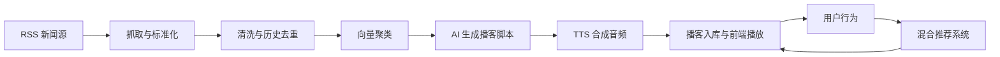
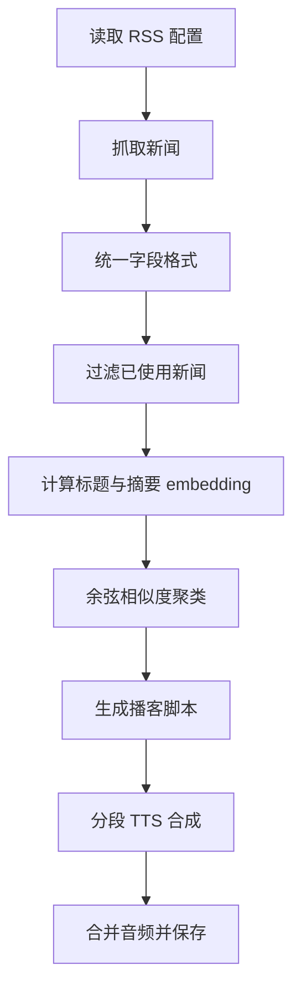
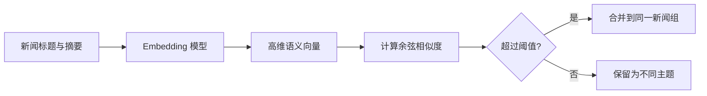
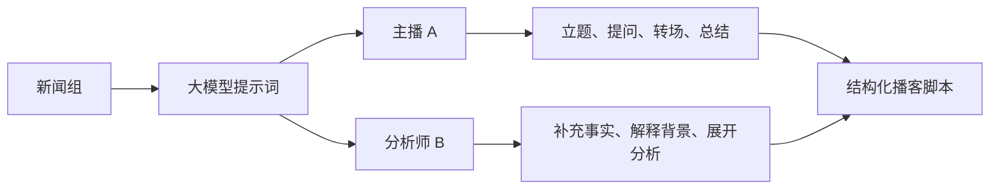
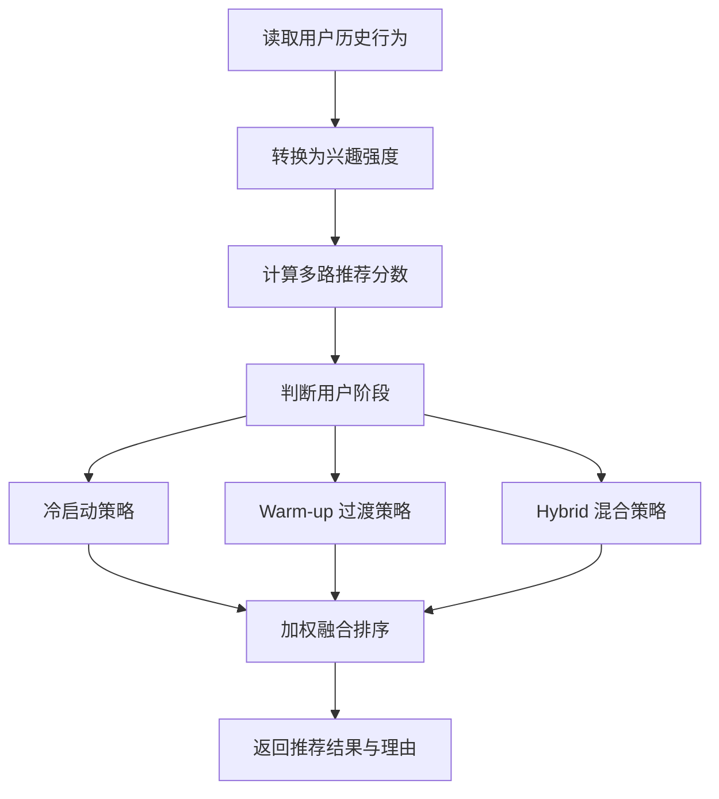
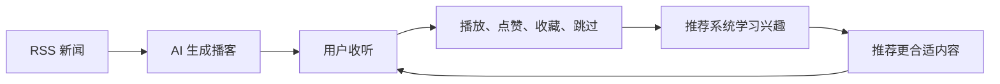

<!-- _class: lead -->

# AI 播客生成系统汇报

基于 RSS 新闻、AI 脚本生成、TTS 语音合成和混合推荐的自动化播客平台

---

## 项目目标

把分散在 RSS 信息源里的新闻内容，自动整理成可以收听的播客节目。

- 自动抓取新闻素材
- 清洗、去重并聚合同类新闻
- 用大模型生成播客脚本
- 通过 TTS 合成完整音频
- 根据用户行为进行个性化推荐

---

## 为什么做这个项目

传统播客生产流程复杂，生产周期较长。

- 选题、资料收集、脚本撰写需要人力投入
- 录音、剪辑和发布流程较慢
- 热点新闻很难被快速转化为音频内容
- 用户还需要从大量节目中主动筛选感兴趣内容

这个项目希望把内容生产和分发流程自动化。

---

## 系统整体链路

---

## 五个核心阶段

1. 新闻采集：从多个 RSS 信息源抓取最新内容
2. 新闻整理：清洗、历史去重、向量聚类
3. 脚本生成：大模型生成结构化播客脚本
4. 音频合成：TTS 分段合成并合并完整音频
5. 入库推荐：保存节目并根据行为优化推荐排序

---

## 核心生成流程

---

## 为什么需要聚类

如果不做聚类，系统会遇到两个问题。

- 内容太碎：单条新闻信息量有限，生成的节目缺少完整背景
- 内容重复：多个 RSS 源可能报道同一个事件，容易生成相似节目

聚类的目标是把相似新闻合并，让一集播客围绕一个主题或事件展开。

---

## 向量聚类流程

即使用词不同，只要语义接近，也可以被聚到同一个新闻组。

---

## 内容生产设计

脚本生成不是简单摘要，而是按照播客节目形式组织内容。

- 明确节目结构：开场、主题引入、主体讲解、背景补充、总结
- 使用双角色对话：主播负责提问和转场，分析师负责解释和展开
- 控制节目节奏：每一段推进一个核心问题，避免信息过载
- 加入音频包装：开头音乐、过渡音乐和结尾音乐

目标是让生成内容从“新闻总结”变成更完整的播客节目。

---

## 双角色播客脚本

双角色设计可以减少单人长篇陈述，让节目更接近真实播客交流。

---

## 混合推荐系统

推荐系统不只按时间或热度排序，而是综合多个信号。

- 用户行为：播放、点赞、收藏、完播、跳过
- 内容相似：根据播客内容特征匹配兴趣
- 全站热度：发现整体表现好的节目
- 新鲜度：新闻类内容需要考虑时效
- 近期兴趣：捕捉用户短期偏好变化
- 完播率：衡量内容质量和吸引力

---

## 推荐流程

---

## 用户阶段策略

| 阶段 | 特点 | 推荐重点 |
| --- | --- | --- |
| 冷启动 | 几乎没有行为 | 热门内容、最新内容、用户偏好 |
| Warm-up | 少量行为 | 冷启动信号 + 初步个性化 |
| Hybrid | 行为较多 | 协同过滤、内容相似、近期兴趣 |

随着用户行为增加，系统逐步提高个性化信号占比。

---

## 数据闭环

这个项目的核心价值是形成从内容生产到个性化分发的闭环。

---

## 开源项目组织

项目不只关注功能跑通，也按照开源项目方式组织。

- 使用 Apache License 2.0
- 提供项目说明文档
- 提供贡献指南，方便后续协作扩展
- 提供安全说明，引导安全问题私下报告
- 后续可以扩展更多语音服务、推荐策略和部署能力

---

## 总结

这个系统把新闻内容生产和个性化推荐串成一条完整链路。

- AI 降低播客内容生产成本
- 向量聚类提升新闻整合能力
- TTS 让文字内容转化为可收听音频
- 混合推荐让内容分发更个性化

在 AI 时代，人不再只是内容的直接生产者，也会成为流程设计者、质量把关者和价值方向定义者。
